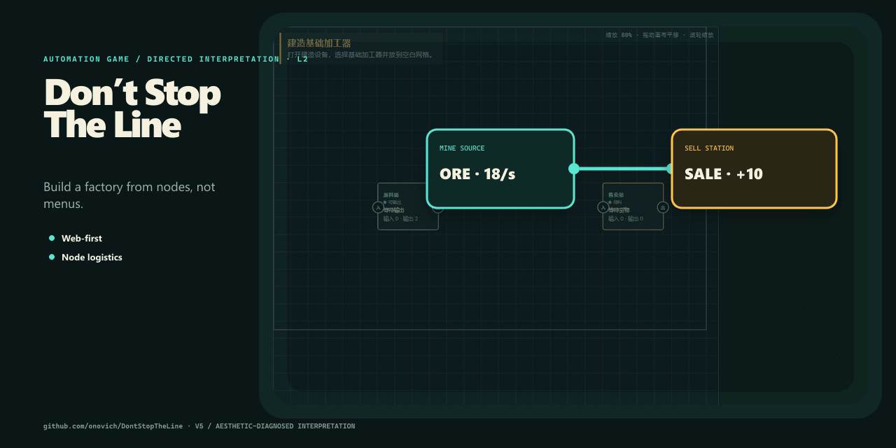

# DontStopTheLine

[English](README.md)

《产线别停》，在有限画布里搭建节点式自动化产线的 Web 优先游戏。



## 项目包含什么

- Web 优先。
- 节点式物流。
- 可玩的生产循环。

## 快速开始

安装依赖并启动本地版本：

```bash
pnpm install
```

仓库还提供 `pnpm run build`、`pnpm run test`、`pnpm run lint`。

## 仓库结构

- `apps/` — 可运行应用。
- `packages/` — 共享包与领域模块。
- `docs/` — 项目文档与设计说明。
- `.github` — 自动化与 GitHub Pages 工作流。
- `package.json` — 包脚本与依赖。

## 文档

- [`docs/architecture.md`](docs/architecture.md)
- [`docs/phase-0-goal-mode-execution-guide.md`](docs/phase-0-goal-mode-execution-guide.md)
- [`docs/phase-1-goal-mode-execution-guide.md`](docs/phase-1-goal-mode-execution-guide.md)
- [`docs/phase-2-goal-mode-execution-guide.md`](docs/phase-2-goal-mode-execution-guide.md)
- [`docs/phase-3-goal-mode-execution-guide.md`](docs/phase-3-goal-mode-execution-guide.md)

## 当前状态

仓库已经包含与上述用途对应的实现和项目材料。仓库内包含自动化测试；具体兼容性仍取决于目标运行时、编辑器或平台。

## 许可证

当前仓库未包含开源许可证。
